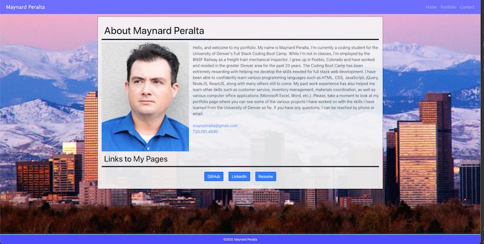
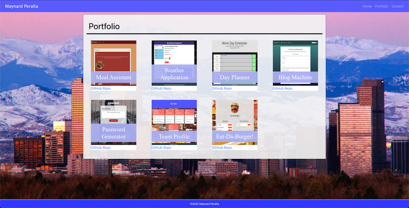

# Maynard Peralta's Portfolio

## Introduction

This is a version of my personal portfolio made with React showcasing the projects I have completed using the education I gained from the University of Denver's full stack coding boot camp program. The projects include collaboration group projects as well as projects I completed myself. 

## Technologies Used
    * HTML
    * CSS
    * Bootstrap CSS
    * React
    * FontAwesome
  
## Screenshots

 
Screenshot of index page.

 

 
Screenshot of portfolio page.

## Deployed Link

The deployed portfolio can be found [here](https://maynperalta.github.io/React-Portfolio/).

## Contact Information
If you have any questions, I can be contacted via email at:
<maynperalta@gmail.com>
 